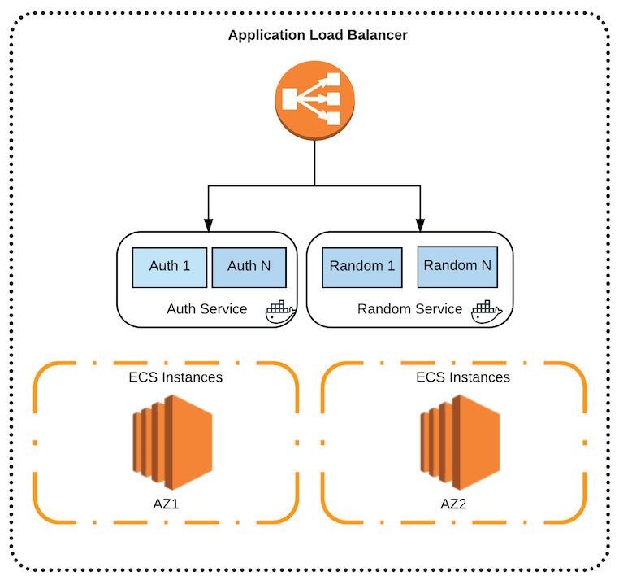

# ECS

In this post we will look at AWS ECS and how it could be used to deploy Docker containers. From a use-case perspective, ECS allows you to build a production scale, auto-scaling and monitored platform for running Docker containers. If you are already using AWS, outside of cost for EC2 instances, there is no additional cost for ECS. So it is a low friction entry point for testing and proof of concepts.

At a high level, ECS is a cluster management framework that provides management of EC2(Elastic Compute) instances that run as Docker Hosts. It includes a scheduler to execute processes/containers on EC2 instances and has constructs to deploy and manage versions of the applications. You can also combine this with AWS Autoscale groups and Load Balancing (Classic and Application) service. In addition, ECS also has autoscaling at the ECS Service level.
 
The goal is to achieve the following :-

 - Deploy two services into ECS, behind a single Load balancer with different target groups.
 
 - Deploy ECS tasks and services using ECS cli.
    
Architecturally, we will build this.



It is assumed that you already have an AWS account and have a VPC to deploy ECS. 
It is also assumed that you have some familiarity with Git & Docker and AWS services like VPC, ELB & EC2. 

## ECS CONCEPTS 


Let's get familiar with some ECS concepts and terms.

 - *Cluster* :  A logical grouping of EC2 container instances. The cluster is a skeleton structure around which you build and operate workloads.
 
 - *Container Instance/s* : This is actually an EC2 instance running the ECS agent. The recommended option is to use AWS ECS AMI but any AMI can be used as long as you add the ECS agent to it. The ECS agent is open source as well.
 
 - *Container Agent* : The agent that runs on EC2 instances to form the ECS cluster. If you are using the ECS optimised AMI, then you don't need to do anything as the agent comes with it. But if you want run your own OS/AMI, you will need to install the agent. The container agent is open source and can be found at [https://github.com/aws/amazon-ecs-agent]().
 
 - *Task Definition* : An application containing one or more containers. This is where you provide the Docker images, how much CPU/Memory to use, ports etc. You can also link containers here similar to Docker command line.

 - *Task* : An instance of a task definition running on a container instance.
 
 - *Service* : A service in ECS allows you to run and maintain a specified number of instances of a task definition. If a task in a service stops, the task is restarted. Services ensure that desired running tasks is achieved and maintained. Services  can also include things like load balancer configuration, IAM roles and placement strategies.
 
 - *Container* : A Docker container that is executed as part of a task.

 - *Service Auto Scaling* : This is similar to the EC2 auto scaling concept but applies to the number of containers you are running for each service.The ECS service scheduler respects the desired count at all times. In addition, a scaling policy can be configured to trigger a scale out based on alarms.


### Prepare Security Groups

 - Create a security groups named *stage01-alb*. In this group, allow port 80 on inbound. 
 
 - Create a security group named *stage01-ecs*. In this group, allow all ports from the *stage01-alb* security group. 
 
 - In both groups, you can allow other ports if you desire but that is not needed for this tutorial.


### Prepare Application Load Balancer (ALB) 

ECS will work with both classic load balancers and application load balancers. Application load balancer (ALB) is the best fit for ECS because of features likes dynamic ports, url based target groups etc. For this example we will create two ALB instances; *auth* and *random*.  
 
   - You have to decide on the ports you will use for the services. In our example, we choose port *10080* for the auth service and *10081* for the random service. This port number is defined separately at all layers; load balancer, task definition, service definition and the actual listener port inside the container. So, it needs to match.
   
   - Create an application load balancer that listens on port 80 and choose the appropriate subnets as per your VPC.
   
   - Create two target groups. *auth* will be our default target group and *random* will be the second. Configure proper health checks as you would with any instance. Do not add any EC2 instances to it. This will be done later on in the ECS service side. Here are the details.

```
aws elbv2 describe-target-groups --name auth
{
    "TargetGroups": [
        {
            "VpcId": "vpc-5cf60f3b", 
            "HealthCheckPath": "/", 
            "HealthCheckIntervalSeconds": 5, 
            "Protocol": "HTTP", 
            "HealthCheckTimeoutSeconds": 2, 
            "HealthCheckProtocol": "HTTP", 
            "UnhealthyThresholdCount": 2, 
            "HealthyThresholdCount": 2, 
            "Matcher": {
                "HttpCode": "200"
            }, 
            "HealthCheckPort": "traffic-port", 
            "Port": 80, 
            "TargetGroupName": "auth"
        }
    ]
}
aws elbv2 describe-target-groups --name random
{
    "TargetGroups": [
        {
            "HealthCheckPath": "/random/", 
            "HealthCheckIntervalSeconds": 5, 
            "VpcId": "vpc-5cf60f3b", 
            "Protocol": "HTTP", 
            "HealthCheckTimeoutSeconds": 2, 
            "HealthCheckProtocol": "HTTP", 
            "UnhealthyThresholdCount": 2, 
            "HealthyThresholdCount": 2, 
            "HealthCheckPort": "traffic-port", 
            "Port": 80, 
            "TargetGroupName": "random"
        }
    ]
}
```

 - *"HealthCheckPort": "traffic-port"* is an important parameter as this one works in conjunction with the Dynamic ports on the ECS side. 


### Prepare Docker Images (Optional)

 - This can be any Docker images but for this example, we built two Docker images that run Ubuntu, Nginx, PHP-fpm. We then added some custom code to it. All the source is available [https://github.com/rackerlabs/ecs-playground](https://github.com/rackerlabs/ecs-playground)
 
 - You can use it to build the docker images yourself and upload them to your Docker hub. This example uses public images but you can also embed Docker Hub credentials and use private images. You can also use AWS Elastic Container Registry (ECR) but for the purpose of this example, we decided to not use that.

 - You can also use the images from the provided Dockerhub account and skip this step completely.

```
git clone https://github.com/rackerlabs/ecs-playground
cd ecs-playground
cd docker 
cd auth
docker build --no-cache -t="<docker hub username>/auth" .
docker push "<docker hub username>/location"
cd ..
cd random
docker build --no-cache -t="<docker hub username>/random" .
docker push "<docker hub username>/random"
```


### Build ECS Cluster

Now let's create the ECS cluster. In this example we are building this in the us-east-1 region. ECS is available in most regions but not all regions are covered. 
 
 - Follow the AWS guide to get the necessary IAM roles etc in place for ECS [Setting Up with Amazon ECS](http://docs.aws.amazon.com/AmazonECS/latest/developerguide/get-set-up-for-amazon-ecs.html)
 
 - Create a ECS cluster. We will name our cluster *stage01*. Note, this step only creates a framework for ECS and does not provision any resources.
  
```
aws ecs create-cluster --cluster-name stage01
```

 -  Create a file called *ecs-bootstrap.txt* with the following content. Since we named the cluster *stage01*, we need to pass that value to the ECS agent. If no value is passed, it assumes the cluster is named default.

```
 #!/bin/bash
echo ECS_CLUSTER=stage01 >> /etc/ecs/ecs.config
```
 
 -  Next, we add EC2 instances to it.  You can do this in the console or via the command line. Make sure the IAM role is pre-created and you have security group id from above. Also to make a cluster, spin up at least 2 instances. If you want to distribute this across availability zones, then you need this separately for each subnet id.
  
```
aws ec2 run-instances \
--image-id ami-195eaf0f \
--key-name <ssh key> \
--security-group-ids <stage01-ecs security group id> \
--instance-type t2.small \
--subnet-id <subnet id> \
--iam-instance-profile Name=ecs \
--user-data file://scripts/ecs-bootstrap.txt \
--count 2
```
 
  - Describe the cluster to make sure registeredContainerInstancesCount is set to the correct value (2)
  

```
aws ecs describe-clusters --cluster stage01
{
    "clusters": [
        {
            "status": "ACTIVE", 
            "clusterName": "stage01", 
            "registeredContainerInstancesCount": 2, 
            "pendingTasksCount": 0, 
            "runningTasksCount": 0, 
            "activeServicesCount": 0, 
            "clusterArn": "arn:aws:ecs:us-east-1:759133634148:cluster/stage01"
        }
    ], 
    "failures": []
}


aws ecs list-container-instances --cluster stage01
{
    "containerInstanceArns": [
        "arn:aws:ecs:us-east-1:759133634148:container-instance/4e042e9a-d63d-412d-8960-fd09314af739", 
        "arn:aws:ecs:us-east-1:759133634148:container-instance/f13220a5-e34f-4498-a5f1-08e4f253a658"
    ]
}

```

 - At this point we have the ECS cluster running with two instances and is ready to take on some workload.
  

### Deploy ECS Tasks and Services

 - The first step is to create a task definition which is an application containing one or more containers. Note, these JSON files are provided in the [git repo](https://github.com/rackerlabs/ecs-playground)

 - Let's first look at a task definition file.
 
```
{
    "containerDefinitions": [
    {
        "name": "auth", 
        "image": "srirajan/auth", 
        "cpu": 512, 
        "memory": 512, 
        "portMappings": [
        {
            "protocol": "tcp",
            "containerPort": 10080,
            "hostPort": 0
        }
        ],
        "essential": true, 
        "dockerLabels": {
          "service": "auth"
        }
    }
  ],
  "family": "auth"
}
```

Parameters explained:

*name* - is the task name.

*image* - is the public image on DockerHub. You can also use private hub or ECR(container registry)

*cpu* - is the number of cpu units to allocate (there are 1024 units per CPU core).

*memory* - is the amount of memory to allocate in MB. Note, if you process consumes more than this, it is killed. So this may require some testing to get it right. It is also a good guardrail to contain process. For e.g. if this belongs to a dev role, you can restrict it's usage.

*portMappings* - The one to one mapping for the EC2 host port and the container port. This can be an array and so you have more than one. If you leave the host port as 0, ECS will automatically select a host port. You will need host port to be set to 0 for dynamic ports to be able to work with the corresponding load balancer configuration. For our example we are using *10080* for Auth service and *10081* for the Random service. The host port is 0 and this allow ECS to pick a dynamic host port.

*DockerLabels* - Labels are a mechanism for applying metadata to Docker objects

*family* - Family is similar to a name for multiple versions of the task definition.

This above list is small subnet of the parameters and is just scratching the surface. There are tons of different options you can use in a task definition. You can read about all the parameters in detail here [http://docs.aws.amazon.com/AmazonECS/latest/developerguide/task_definition_parameters.html](http://docs.aws.amazon.com/AmazonECS/latest/developerguide/task_definition_parameters.html)


 - Register the task definition. This does not instantiate the task.

```
aws ecs register-task-definition --cli-input-json file://ecs/tasks/auth.json
aws ecs register-task-definition --cli-input-json file://ecs/tasks/random.json
```


 - Verify using the cli
 
 ```
 aws ecs list-task-definitions
 ``` 

 -  Next, we create the services that use these task definitions. Here's an example of the service file. Note, these JSON files are provided in the [git repo](https://github.com/rackerlabs/ecs-playground)
 
```
{
  "cluster": "stage01",
  "serviceName": "auth", 
  "taskDefinition": "auth",
  "loadBalancers": [
      {
          "targetGroupArn": "Replace with ARN of the Auth target group",
          "containerName": "auth", 
          "containerPort": 10080
      }
  ], 
  "role": "< ARN of ecsServiceRole>", 
  "desiredCount": 2, 
  "deploymentConfiguration": {
      "maximumPercent": 200, 
      "minimumHealthyPercent": 50
  }, 
  "placementStrategy": [
      {
          "field": "attribute:ecs.availability-zone", 
          "type": "spread"
      }, 
      {
          "field": "instanceId", 
          "type": "spread"
      }
  ]
}
```

Parameters explained:

*cluster* : The ECS cluster name

*serviceName* : The service name

*taskDefinition* : The task definition name

*loadBalancers* : This is where we plug in the load balancer target group from before. This is the ARN for it. The container name matches the task and you pick the same port you select in the definition. Note, you can have multiple tasks inside a service. 

*role*  : The ECS service IAM role

*desiredCount*: The number of tasks you want to be always running. ECS will maintain this number and so any containers that crash will be replaced. 

*deploymentConfiguration* :  This group plays a key part in rolling updates. minimumHealthyPercent ensures that the number of running tasks never falls below it. The maximumPercent is an upper limit on the number of your tasks that are allowed in the RUNNING or PENDING state. This parameter enables you to define the deployment batch size. For example, if your service has a desiredCount of four tasks and a maximumPercent value of 200%, the scheduler may start four new tasks before stopping the four older tasks (provided that the cluster resources required to do this are available). The default value for maximumPercent is 200%.

*placementStrategy* : The algorithm for task placement or termination. There are 3 options; *binpack* - Place tasks based on the least available amount of CPU or memory, *random* -  Place tasks randomly and *spread* - Place tasks evenly based on the specified attribute


 - Create the services. Finally, after all this work, we will have some containers running.
 
```
aws ecs create-service --cli-input-json file://ecs/services/auth.json
aws ecs create-service --cli-input-json file://ecs/services/random.json
```

 - As per definitions, *auth* service will be started with two tasks(containers) and *random* will be started with four tasks.
 
- You can check the status via command line.

```
aws ecs describe-services --services auth --cluster stage01
```

 - If all is working you will see a "runningCount" of 2 and the corresponding load balancer is now serving traffic. If you used the Docker images that were provided, then you can also access <ALB DNS Name>/discover.php which will print out some details.
 
 - *random* service will have 4 running tasks and can be accessed via <same ALB DNS Name>/random/


### Ongoing Management of ECS Tasks and Services


In a typical workflow change to the application will start from a change to the Docker image . This image needs to be pushed to Docker hub, under a new tag. Then, you update the json file for the task definition with the new tag. The only thing that changes in the json file is the image link/version. If you don't use tags and rely on the latest docker image, then no change is needed to the json file. The process to update is the same as registering the tasks

E.g.
 
```
aws ecs register-task-definition --cli-input-json file://ecs/tasks/auth.json
```

Then we update the service to use the new version. In an update scenario, minimumHealthyPercent plays an important part. This ensures, the upgrade is rolled out in a rolling fashion and the service never goes below the minimumHealthyPercent.

E.g.
 
```
aws ecs update-service --cluster default --service auth --desired-count 2 --task-definition auth:2 --deployment-configuration maximumPercent=200,minimumHealthyPercent=50
```


### Parting thoughts

There is a lot more to ECS and spend some time with the AWS console, especially, the metrics tab to view the usage of your cluster. Here are some other points worth considering.

 - AWS recommends using their EC2 AMIs for the EC2 instances. If you want more control over this or want run CoreOS or similar, then you need to bake ECS agents into those AMIs. The ECS agent is open source and so you can easily do that. Always run the latest agent version or the Container agent. The earlier versions had a few bugs and ECS is a changing ecosystem. 
 
 -  If you want to use AWS Linux as Docker Images, please refer to instructions under [https://hub.docker.com/_/amazonlinux/](https://hub.docker.com/_/amazonlinux/)


 - Service discovery is limited inside ECS. You can use environment variables in task definitions but that is not service discovery per say. You can run something like Consul or Weave and use it for service discovery. AWS has a good blog article on this ; [https://aws.amazon.com/blogs/compute/service-discovery-via-consul-with-amazon-ecs/]()

 - Use ECS schedulers for auto-recovery of services. ECS has few in-built options and also allows external schedulers. So you can use something like Mesos with ECS; [https://github.com/awslabs/ecs-mesos-scheduler-driver]()  

 - There is no central Docker endpoint as far as the ECS cluster is concerned. As a developer, you cannot point your local Docker client to an ECS endpoint. Note, while some may see this as a limitation, the purpose of ECS is not to provide a Docker endpoint. ECS purpose is targetted at running Docker instances from an Operations perspective. 
 
 - You are still running a container inside a virtual machine. Bare-metal performance is always the best option for containers but AWS has started providing ways to control the underlying hardware. Eg. Controlling the C-states; [http://docs.aws.amazon.com/AWSEC2/latest/UserGuide/processor_state_control.html]()
  
 - Windows containers are now available in Beta. These are launched with the Microsoft Windows Server 2016 Base with Containers AMI. Note, Windows on ECS is not at feature parity with Linux.  Also the Windows images are much larger which means the spin up time is high for the first time you run a Windows container. 
  
==========

## References and Links

 - [http://docs.aws.amazon.com/cli/latest/reference/ecs/]()
 
 - [http://docs.aws.amazon.com/AWSEC2/latest/UserGuide/processor_state_control.html]()

